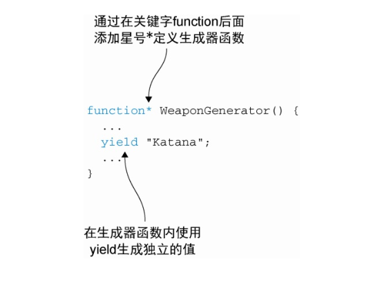

## 生成器generator函数
生成器函数能生成一组值的序列，但是每个值的生成都是基于一次请求，我们必须显示的向生成器请求一个新的值，随后生成器响应一个新生成的值，或者告诉我们它不会再生成新的值。
### 创建生成器函数
在关键字function后面加一个 * 就能定义一个生成器函数，这样一来生成器内部就能使用新关键子yield生成独立的值。

### 迭代器对象控制生成器
调用生成器并不会执行生成器函数，它会创建一个叫作迭代器（iterator）的对象。这个迭代器对象暴露一个next方法，这个方法可以用来向生成器请求一个值，从而控制生成器。调用next方法后，生成器就会开始执行代码，执行到yeild关键字时，就会生成一个中间结果，然后返回一个新对象，新对象封装了结果值和一个指示完成的指示器。  
每当生成一个值后，生成器都会不阻塞的挂起。
```js
function* WeaponGenerator() {
yield "Katana";
yield "Wakizashi";
} // 定义一个生成器，它能生成一个包含两个武器数据的序列
const weaponsIterator = WeaponGenerator(); // 调用生成器得到一个迭代器，从而我们能够控制生成器的执行
const result1 = weaponsIterator.next();// 调用迭代器的next方法向生成器请求一个新值
assert(typeof result1 === "object"
&& result1.value === "Katana"
&& !result1.done,
"Katana received!");// 结果为一个对象，其中包含着一个返回值，及一个指示器告诉我们生成器是否还会生成值
const result2 = weaponsIterator.next();
assert(typeof result2 === "object"
&& result2.value === "Wakizashi"
&& !result2.done,
"Wakizashi received!"); // 再次调用next方法从生成器中获取新值
const result3 = weaponsIterator.next();
assert(typeof result3 === "object"
&& result3.value === undefined
&& result3.done,
"There are no more results!"); // 当没有可执行的代码，生成器就会返回“undefined”值，表示它的状态为已经完成
```
### 使用生成器

### 与生成器交互

### 生成器内部构成

## promise
### 使用promise
Promise是异步编程的一种解决方案，避免了层层嵌套的回调函数  
简单来说，它是一个容器，里面保存着某个未来才会结束事件的结果；从语法上来说，Promise是一个对象，从它可以获取异步操作的消息。  
Promise有三种状态，pending，fulfilled, rejected。只有异步操作的结果能决定当前是哪一种状态。当pending状态变为fulfilled或者pending状态变为rejected状态后，状态就不会再发生变化了。此时再对Promise添加回调函数也会立即得到这个结果。  

缺点：无法取消Promise，Promise内部抛出的错误不会反应到外部，当处于pending状态时，无法得知目前进展到哪一阶段。  

在ES6中，Promise是一个构造函数，用来生成Promise实例。Promise构造函数接受一个函数作为参数，这个函数有两个参数`resolve`和`reject`，他们是两个函数。`resolve`将Promise对象的状态从pending转为fulfilled，函数在异步操作成功时调用，并将异步操作的结果作为参数传递出去，`reject`将Promise对象的状态从pending转为rejected，在异步操作失败时调用，并将异步操作报出的错误作为参数传递出去。
```js
const promise = new Promise(function(resolve,reject) {
  if('/*异步操作成功*/'){
    resolve(value)
  }else{
    reject(error)
  }
})
```
Promise实例生成以后，可以用then方法指定Promise在fulfilled状态和rejected状态的回调函数。then方法可以接受两个回调函数作为参数，第一个回调函数是Promise对象的状态变为fullfilled时调用，第二个回调函数是可选的，在Promise对象的状态变为rejected时调用。这两个回调函数都接受Promise对象传出的值作为参数。
```js
promise.then(function(value){

},function(error){

})
```
Promise的一个简单的例子
```js
function timeout(ms) { // 函数timeout返回了一个Promise实例
  return new Promise((resolve, reject) => {
    setTimeout(resolve, ms, 'done') // 过了ms时间后，调用resolve函数，将Promise状态变为resolved，
    //并将'done'作为异步操作结果作为参数传递给resolve。
  })
}
timeout(1000).then( (value) => {  //在Promise状态变为fullfilled时调用这个箭头回调函数
  alert(value)
})
```
再来看一个例子
```js
let promise = new Promise((resolve,reject) => {
  console.log('promise');
  resolve()
})

promise.then(() => {
  console.log('fullfilled');
})

console.log('Hello');
// promise
// Hello
// fullFilled
```
这个Promise实例新建后会立即执行，然后就会打印promise，然后resolve()将promise状态变为fullfilled，然后，promise的then方法指定的回调函数属于微任务，会在宏任务执行完才会执行，所以fullfilled最后输出。  

下面看一个异步加载图片的例子
```js
function loadImgAsync(url) {
  return new Promise ((resolve,reject) =>{
    const image = new Image();

    image.onload = function() {
      resolve(image);
    }

    image.onerror = function() {
      reject(new Error('can not get image at' + url));
    }

    image.src = url;
  })
}
```
上面代码中，使用Promise包装了一个图片加载的异步操作。如果加载成功，就调用resolve方法，否则就调用reject方法

下面看一个用Promise对象实现Ajax操作的例子
```js
const getJSON = function(url) {
  const promise = new Promise(function(resolve,reject) {
    const handler = function() {
      if(this.readyState !== 4) {
        return;
      }
      if(this.status === 200) {
        resolve(this.response);
      }else{
        reject(new Error(this.statusText));
      }
    };
    const client = new XMLHttpRequest();
    client.open("GET",url);
    client.onreadystatechange = hadler;
    client.responseTyoe = "json"
    client.setRequestsHeader("Accept","application");
    client.send();
  });
  return promise;
}

geJSON("/posts.json").then(function(json) {
  console.log('Contents: ' + json);
},function(error){
  console.log('出错了',error);
});
```
### 处理拒绝promise
拒绝promise有两种方式，显示拒绝和隐式拒绝
1. 显示拒绝，在一个Promise执行函数中调用传入的reject函数，然后then的第二个回调函数会被调用
```js
const promise = new Promise((resolve,reject) => {
  reject(new Error("显示拒绝promise"))
});

promise.then(
  () => console.log("没有被拒绝"),
  error => console.log(error);
)
```
2. 隐式拒绝，正处理一个promise的过程中抛出一个异常，链式调用catch来处理
```js
const promise = new Promise((resolve,reject) => {
  something++
});

promise.then(
  () => console.log("没有被拒绝")
).catch(
  error => {
    console.log('隐式拒绝', error)
  }
)
```
### 链式promise
Promise链就像下面代码
```js
new Promise((resovle,reject) => {
  setTimeout(() => resolve(1), 1000);
}).then(result => {
  alert(result);
  return result * 2;
}).then(result => {
  alert(result);
  return result*2;
}).then(result => {
  alert(result);
  return result * 2;
})
```
原理就是将result通过.then()处理程序链调用。  
因为promise.then的调用会返回一个promise，所以我们可以在其之上调用下一个.then。
### promise错误处理
Promise链在错误处理中非常强大，当一个promise被reject时，会将控制权移交给最近的rejection处理程序。
`.catch`处理promise中各种error：不论是reject函数调用产生的，还是处理程序中抛出的。
### promise.all的实现
promise.all允许我们并行的执行多个promise，promise.all接受一个promise数组作为参数，返回一个新的promise。数组里的promise都是fullfilled则新的promise是fullfilled，如果任意一个promise被reject，则新promise就立即reject，并且带有这个promise的error
### promise.race的实现
与promise.all类似，但只等待第一个settled的promise并获取其结果(或error)
### async/await